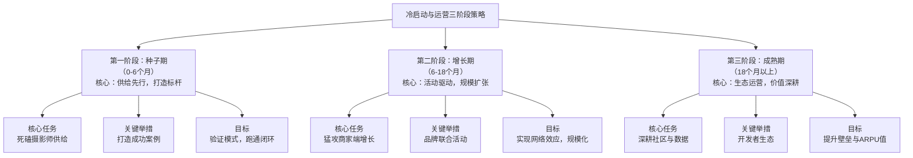

### **平台冷启动与运营策略**

整个策略将分为三大阶段推进，其核心工作与演进路径如下图所示：

---

### **第一阶段：种子期（0-6个月）—— 核心：供给先行，打造标杆**

**目标**：**搞定优质摄影师供给，生产出首批高质量案例，验证核心流程。**

| 策略方向                              | 具体执行方案                                                                                                                                                                                                                                                                                                    |
| :------------------------------------ | :-------------------------------------------------------------------------------------------------------------------------------------------------------------------------------------------------------------------------------------------------------------------------------------------------------------- |
| **1. 死磕摄影师供给（核心中的核心）** | • **定向邀请**：从图虫、微博、小红书等平台，手动邀请一批有作品、有审美的摄影师入驻，作为**种子摄影师**。 • **极致优惠**：为首批种子摄影师提供 **“0佣金”政策**（期限为半年或前100单），并给予“金牌摄影师”认证标识。 • **工具赋能**：优先开发能提升他们效率的功能（如云端交付网盘），解决其痛点，增加粘性。 |
| **2. 自营标杆案例打造**               | • **平台出资**：若初期商家需求不足，平台可出资联合种子摄影师，为少数**标杆品牌**（如小众设计师品牌、精品咖啡店）免费或低价拍摄一套商品图。 • **案例包装**：将这些案例包装成《平台出品》的深度文章/视频，在全网分发，成为吸引商家的“武器”。                                                                   |
| **3. 社群化运营**                     | • 建立种子用户的**微信社群**（摄影师群、商家群），CEO和运营团队直接深入社群，收集一手反馈，快速迭代产品，建立情感连接。                                                                                                                                                                                         |
| **4. 内测邀请制**                     | • 初期采用邀请码制度，制造稀缺感和精英感，重点吸引**注重品质、厌恶“照骗”** 的早期消费者。                                                                                                                                                                                                                       |

---

### **第二阶段：增长期（6-18个月）—— 核心：活动驱动，规模扩张**

**目标**：**猛攻商家端增长，激发社区活力，实现规模化的网络效应。**

| 策略方向              | 具体执行方案                                                                                                                                                                                                                                                                                         |
| :-------------------- | :--------------------------------------------------------------------------------------------------------------------------------------------------------------------------------------------------------------------------------------------------------------------------------------------------- |
| **1. 猛攻商家端获客** | • **行业聚焦**：重点攻克**服装、美食、家居**等视觉驱动型行业，参加行业展会，进行地推。 • **效果广告投放**：在微信朋友圈、抖音等渠道，面向“电商运营”、“品牌主理人”等群体投放广告，强调“**专业图片提升转化率**”。 • **销售团队开拓**：建立直销团队，重点攻克行业头部品牌客户。                   |
| **2. 活动与内容运营** | • **平台活动**：定期举办 **#光图主题摄影赛#**（如夏日穿搭、美食摄影），提供高额奖金和流量曝光，激励创作，沉淀内容。 • **创作者扶持**：推出 **“新星计划”**，每周推荐一位优秀新摄影师，给予流量扶持。 • **IP栏目打造**：打造《跟着光图学拍摄》等栏目，分享摄影技巧、幕后花絮，提升专业社区氛围。 |
| **3. 激励与裂变**     | • **老带新计划**：实施“**鹰眼计划**”，摄影师或商家成功邀请一名新摄影师/商家入驻，可获得高额现金或佣金券奖励。 • **用户成长体系**：建立积分、勋章、等级系统，提升用户忠诚度和每日登录动机。                                                                                                        |

---

### **第三阶段：成熟期（18个月+）—— 核心：生态运营，价值深耕**

**目标**：**提升平台生态价值，挖掘单用户价值，构建牢固护城河。**

| 策略方向              | 具体执行方案                                                                                                                                                                                             |
| :-------------------- | :------------------------------------------------------------------------------------------------------------------------------------------------------------------------------------------------------- |
| **1. 数据与工具赋能** | • **数据产品**：为摄影师提供“作品数据分析”（如点击率、带来的商品浏览量），为商家提供“行业视觉趋势报告”，将其变为付费的增值服务。 • **高级工具**：推出AI修图、营销素材一键生成等SaaS工具，按需收费。   |
| **2. 深度生态合作**   | • **器材合作**：与相机（佳能、索尼）、镜头品牌合作，提供设备试用、会员折扣，甚至联合营销。 • **电商平台打通**：开发“一键同步”插件，让商品可同步至淘宝、京东等平台，扩大商家价值，平台可收取额外费用。 |
| **3. 品牌升级与破圈** | • **打造年度盛事**：举办“光图大会”，颁发年度奖项，成为行业风向标。 • **跨界联名**：与知名品牌推出联名商品，由平台摄影师拍摄，提升平台品牌调性和破圈影响力。                                           |

### **总结：策略核心要点**

1.  **绝对优先供给**：不惜一切代价确保首批摄影师的质量和收益，他们是平台的“火种”。
2.  **案例是最好的广告**：用真实的、高质量的案例去吸引商家，而不是空泛的概念。
3.  **社区是护城河**：通过持续的内容运营和活动，将平台从一个“工具”升级为一个“社区”，极大增加用户迁移成本。
4.  **数据驱动迭代**：密切关注**订单转化率、摄影师接单率、完单周期、用户留存率**等核心指标，指导运营策略的调整。

这套组合拳旨在系统地解决平台冷启动的“鸡生蛋蛋生鸡”难题，并为其长期增长奠定坚实的基础。
