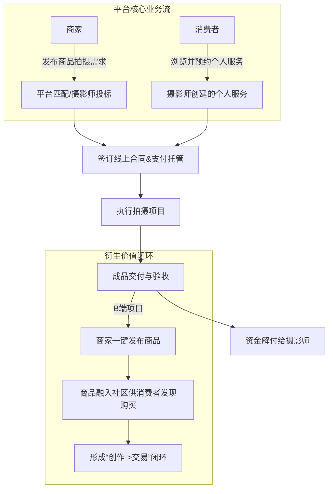

## 1. 文档概述

### 1.1. 产品简介

项目是一个创新的垂直平台，其核心模式是 **“专业摄影服务驱动高品质商品交易”** 。我们通过整合认证摄影师资源，为注重品牌形象的商家提供一站式的商品视觉解决方案，同时为消费者提供便捷可靠的个性化摄影服务，构建一个以高质量图片内容为核心的创作与消费社区。

### 1.2. 产品愿景

成为品牌商家和个人消费者寻找专业视觉创作服务的首选平台，重塑视觉内容的商业价值。

### 1.3. 产品Slogan

**让每一次快门，都产生价值。**

### 1.4. 目标用户

| 用户角色   | 核心需求                                                 | 使用场景                                           |
| :--------- | :------------------------------------------------------- | :------------------------------------------------- |
| **摄影师** | 稳定获客、提升效率、保障收益、建立个人品牌               | 展示作品集、接单赚钱、管理项目、与客户沟通         |
| **商家**   | 高效获取高质量商品图片、提升商品转化率、打造品牌         | 寻找摄影师、发布拍摄需求、管理商品和订单           |
| **消费者** | 发现优质商品、获取灵感、获得可信的购物参考、预约摄影服务 | 浏览内容、收藏点赞、购买商品、预约拍摄、关注创作者 |

### 1.5. 核心业务逻辑

## 2. 全局说明

### 2.1. 名词解释

- **B端服务**：指摄影师为商家提供的**商品图摄**服务。
- **C端服务**：指摄影师为消费者提供的**个人写真、婚礼纪实、亲子家庭**等服务。
- **资金托管**：用户支付款项暂时由平台保管，待服务完成并确认后，再解付给摄影师。
- **需求大厅**：商家发布具体拍摄需求的板块，摄影师可进行投标。

### 2.2. 假设与依赖

- 假设目标用户群体有为高质量视觉内容付费的意愿和能力。
- 依赖第三方支付接口（支付宝、微信支付）的稳定性和安全性。
- 初期需要人工审核确保摄影师和商家质量。

## 3. 功能需求（分阶段）

### 3.1. 第一阶段：MVP - 核心服务交易闭环

**目标**：验证摄影师与商家（B端）、摄影师与消费者（C端）之间的服务交易流程。

| 模块           | 功能点         | 需求描述                                                                                                                | 优先级 |
| :------------- | :------------- | :---------------------------------------------------------------------------------------------------------------------- | :----- |
| **用户与认证** | 用户注册/登录  | 支持手机号+验证码登录。                                                                                                 | P0     |
|                | 摄影师认证     | 后台提交身份证、作品集（3组）、进行能力测试，人工审核。                                                                 | P0     |
| **服务市场**   | 创建服务       | 摄影师可创建服务，**必须选择类型：B端（商品图摄）或C端（如写真约拍）**，包含标题、描述、价格、样图。C端服务需选择城市。 | P0     |
|                | 浏览与发现     | 用户可浏览摄影师列表和服务页面，支持按**服务类型、风格、价格、城市（C端）** 筛选。                                      | P0     |
| **交易流程**   | 下单与支付     | 用户选择服务后，可下单并支付全款至平台托管。集成支付宝/微信支付。                                                       | P0     |
|                | 订单管理       | 双方有独立的订单中心，查看订单状态（待接单、进行中、待交付、已完成）。                                                  | P0     |
|                | 站内信沟通     | 集成站内信功能，支持订单内的详细沟通（C端服务强依赖）。                                                                 | P0     |
| **后台管理**   | 用户管理       | 审核摄影师资质，管理用户状态。                                                                                          | P0     |
|                | 内容与订单管理 | 管理上架的服务、查看平台所有订单。                                                                                      | P0     |

### 3.2. 第二阶段：社区与电商闭环

**目标**：构建内容社区，打通“摄影-商品”发布闭环，完善C端体验。

| 模块         | 功能点       | 需求描述                                                                                       | 优先级 |
| :----------- | :----------- | :--------------------------------------------------------------------------------------------- | :----- |
| **内容社区** | 发布动态     | 用户（尤其摄影师）可发布图文动态，展示作品和工作花絮，可关联B端或C端服务。                     | P1     |
|              | Feed流       | 首页为双列Feed流，包含“推荐”和“关注”流。                                                       | P1     |
|              | 互动功能     | 支持对动态进行点赞、评论、收藏。                                                               | P1     |
|              | 个人主页     | 摄影师拥有专属主页，展示作品集、服务、简介和评价。支持按服务类型筛选作品。                     | P1     |
| **电商闭环** | 商家认证     | 用户可提交企业资质，申请成为商家。                                                             | P1     |
|              | **商品发布** | **【核心功能】** 商家发布商品时，**必须选择**一个已完成的B端摄影订单，将其成品图作为商品主图。 | P1     |
|              | 商品交易     | 完整的商品详情页、购物车、下单支付流程。                                                       | P1     |
| **平台体系** | 评价系统     | 订单完成后，双方可互相评价。C端和B端评价维度不同（如C端包含“沟通态度”）。                      | P1     |
|              | 通知系统     | 集成App Push和短信，通知订单状态、消息提醒。                                                   | P1     |

### 3.3. 第三阶段：生态扩展与效率提升

**目标**：拓展业务边界，提升平台效率和用户体验。

| 模块         | 功能点     | 需求描述                                                                | 优先级 |
| :----------- | :--------- | :---------------------------------------------------------------------- | :----- |
| **效率工具** | 需求大厅   | 商家发布具体拍摄需求，摄影师可投标报价。                                | P2     |
|              | 项目管理   | 为摄影师提供档期日历（可公开）、线上合同模板（C端）等工具。             | P2     |
|              | 套餐模板   | 支持摄影师为C端服务设置不同的套餐（如“精修9张”、“精修15张+所有底片”）。 | P2     |
|              | AI智能匹配 | 根据商家需求，智能推荐最合适的摄影师。                                  | P2     |
| **商业扩展** | 营销工具   | 提供优惠券、限时折扣等促销功能。                                        | P2     |
|              | 广告系统   | 开设首页Banner、搜索排名等广告位。                                      | P2     |
|              | 增值服务   | 推出摄影师/商家的高级会员服务，包含更多曝光和工具。                     | P2     |
| **体验优化** | 积分体系   | 建立积分、任务、等级系统，提升用户粘性。                                | P2     |
|              | 多端适配   | 开发PC端后台，方便摄影师和商家管理。                                    | P2     |

## 4. 非功能需求

1.  **性能**：
    - 首页图片Feed流加载时间低于2秒，支持懒加载。
    - 图片上传与处理使用CDN加速。

2.  **安全**：
    - 用户密码加密存储，支付接口符合PCI DSS标准。
    - 防止SQL注入和XSS攻击。
    - 明确的用户隐私政策。

3.  **兼容性**：
    - 支持iOS & Android主流版本。
    - Web端支持主流浏览器（Chrome, Safari, Edge）。

4.  **可用性**：
    - 界面设计简洁直观，遵循iOS和Material Design设计原则。
    - 关键操作有明确引导和反馈。

## 5. 后续版本考量

1.  **金融服务**：与第三方合作，提供交易保障、分期付款等服务。
2.  **开放平台**：开放API，与电商平台（如淘宝、Shopify）打通，方便商家同步商品。
3.  **版权保护**：探索区块链等技术，为摄影作品提供存证服务。
4.  **硬件集成**：探索与相机厂商合作，实现“拍摄即上传”的云端工作流。

---
