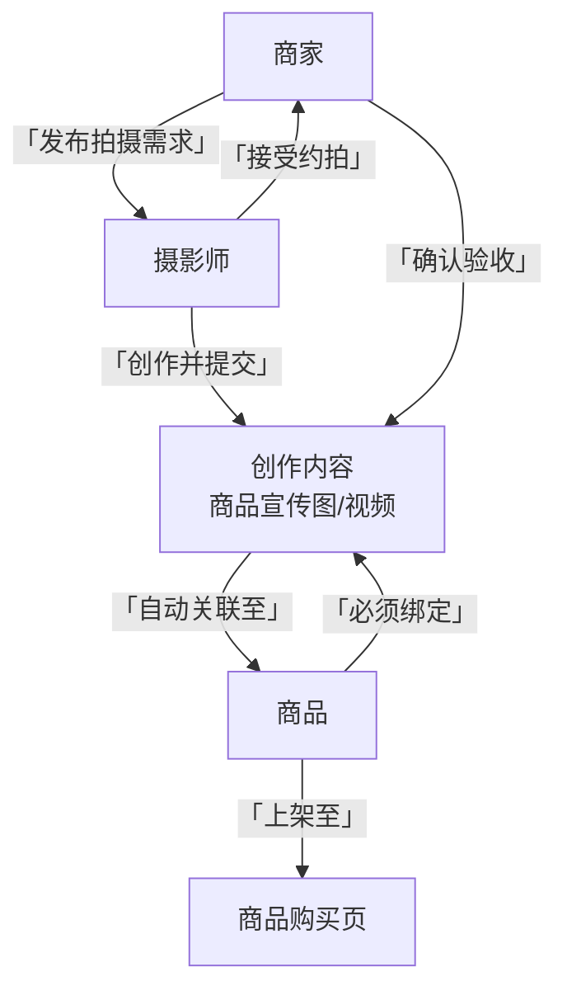

一个以“摄影创作”为核心驱动力，反向赋能电商的垂直平台。\*\*

1. **所有商品都必须有高质量的专业图片**（由平台认证的摄影师拍摄），这本身就是平台的巨大质量壁垒。
2. **摄影师**的角色被提升到了生态系统的**核心枢纽**位置，连接了内容创作和商业交易。
3. **商家**的目标不仅是卖货，更是**为商品获取最佳的宣传素材**。

以下是基于这个全新逻辑调整后的平台方案：

---

### 一、核心角色与关系重构

**核心规则：**

1.  **一个商品（SKU）的诞生，必须始于一次摄影服务。**
2.  商家发布商品时，必须关联一个已完成的、由摄影师创作的“商品图摄”项目。
3.  该创作内容（图片/视频）会自动成为商品的主图、详情页和宣传素材。

### 二、核心业务流程：“商品图摄”服务

这是平台最核心的交易和工作流程，专门为商家获取商品图片而设计。

1.  **需求发布 (商家侧)**
    - 商家填写详细的《拍摄需求单》：
      - **商品信息**： 寄送样品或提供商品信息。
      - **拍摄风格**： 选择标签（如：极简风、新中式、氛围感、科技感）、参考图。
      - **交付要求**： 张数、格式（RAW/JPG）、视频时长等。
      - **预算与时限**： 愿意支付的费用和期望完成时间。

2.  **需求撮合 (平台侧)**
    - **智能匹配推荐**： 系统根据摄影师的风格标签、历史作品、口碑评分，将需求推荐给最合适的摄影师。
    - **项目竞标模式**： 摄影师也可以浏览公开需求，提交拍摄方案和报价进行竞标。

3.  **项目执行**
    - **线上签约**： 双方确认后，生成线上合同，商家支付款项至平台托管。
    - **创作与沟通**： 平台提供协作工具（如：创建灵感看板、样片反馈），确保过程顺畅。
    - **成品交付**： 摄影师通过平台专属通道交付成片，防止原图泄露。

4.  **成果转化**
    - **商家验收**： 商家确认后，托管资金解付给摄影师。
    - **一键上架**： 系统自动将验收的图片生成一个“新商品”，商家只需补充标题、价格等文本信息即可上架。
    - **版权明确**： 图片版权归摄影师所有，商家获得永久的、限定的商业使用授权（可在详情页明确标注“摄影：@摄影师A”）。

### 三、功能模块调整亮点

1.  **摄影师工作室（后台）**
    - **新增“商业项目”选项卡**： 专门管理来自商家的“商品图摄”需求，与传统个人“约拍”服务区分开。
    - **数据分析看板**： 显示其作品带来的商业转化（如：其拍摄的图片为某商品带来了多少点击率和销量），这将成为摄影师重要的履历和定价依据。

2.  **商家后台**
    - **核心是“发起拍摄需求”**： 这是商家进入平台的第一个且最重要的入口。
    - **商品管理**： 每个商品都会显示其关联的摄影师信息和原创图片，增强商品的可信度和质感。

3.  **前台展示**
    - **商品详情页**： 显著位置标注 **“本商品图片由 @摄影师A 专业拍摄”**，点击可跳转到摄影师主页。这既尊重了摄影师的劳动，也为摄影师带来了流量。
    - **双重发现流**：
      - **创作发现流**： 欣赏美图，关注摄影师。
      - **商品发现流**： 购买高品质商品，但商品本身也是摄影作品。
      * 作品标签系统：

- 自动标签（AI识别场景/主体）
- 手动标签（风格/器材/地点）
- 版权保护：
- 水印自定义工具
- 原创存证（对接区块链服务）

### 二、核心业务逻辑

1. **摄影师认证流程**
   - 三阶审核：
   1. 基础认证（身份证+人脸识别）
   2. 作品评审（提交3组主题作品）
   3. 能力测试（构图/色彩知识答题）
   - 动态等级：
   - 铜级（新手）：接单量限制
   - 银级（专业）：开通高价服务
   - 金级（大师）：平台推荐位

2. **服务交易保障**
   - 资金托管：平台担保交易
   - 成片争议：三方评审机制
   - 保险服务：拍摄意外险（可选）
