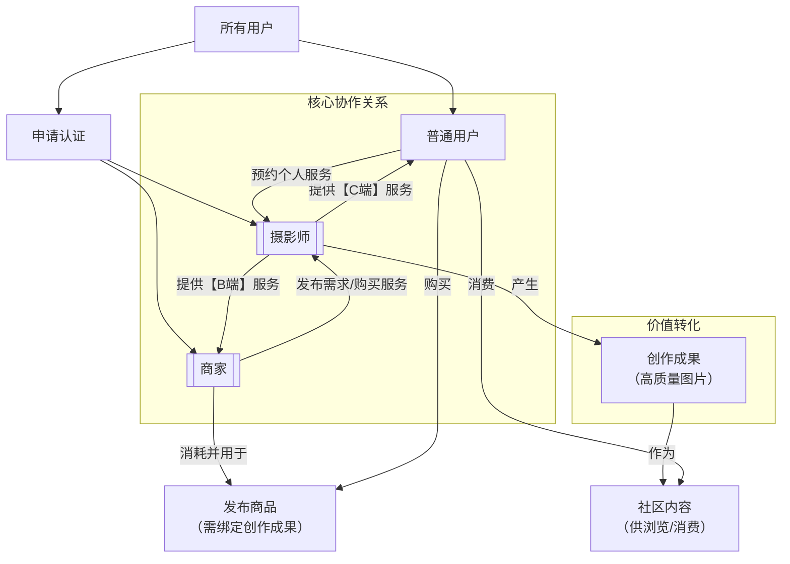

平台的身份体系设计是其商业模式的核心，旨在构建一个权责清晰、相互赋能、闭环流转的生态系统。其核心关系与流转路径如下图所示：

---

### **三大核心身份**

| 身份         | 定义                                                         | 核心能力与权限                                                                                                                                                                                                                                                                  | 如何成为                                                     |
| :----------- | :----------------------------------------------------------- | :------------------------------------------------------------------------------------------------------------------------------------------------------------------------------------------------------------------------------------------------------------------------------ | :----------------------------------------------------------- |
| **普通用户** | 平台的**基础角色**和**流量基座**。所有新用户默认身份。       | 1. **消费内容**：浏览图文Feed流、发现灵感。 2. **互动**：点赞、评论、收藏、分享。 3. **购买**：购买平台上的商品。 4. **预约服务**：预约摄影师发布的个人写真等【C端服务】。                                                                                             | **默认身份**。注册后即为普通用户。                           |
| **摄影师**   | 平台的**核心创作者**和**服务提供方**，是内容生态的供给源头。 | 1. **拥有普通用户所有权限**。 2. **发布服务**：创建并售卖【B端】（商品图摄）和【C端】（个人写真等）服务。 3. **展示作品**：拥有专属主页，展示作品集、服务项目和评价。 4. **接单赚钱**：响应“需求大厅”或直接接收订单，完成项目后获得报酬。                              | 需提交资质证明（作品集、身份信息等），通过平台**审核认证**。 |
| **商家**     | 平台的**商业需求方**和**商品销售方**，是商业生态的关键驱动。 | 1. **拥有普通用户所有权限**。 2. **发布需求**：在“需求大厅”发布具体的【B端】拍摄需求，邀请摄影师投标。 3. **发布商品**：**（核心权限）** 在平台发布商品，且**必须绑定一个已完成的、由摄影师创作的【B端】项目**作为视觉素材。 4. **管理店铺**：管理已发布的商品和订单。 | 需提交企业资质证明，通过平台**审核认证**。                   |

---

### **身份体系的核心特点**

1.  **闭环关联**：
    - **商家**与**摄影师**通过【B端服务】强关联：商家发布的每一个商品，都必须源自一位摄影师的创作。这构成了平台最深的护城河。
    - **普通用户**与**摄影师**通过【C端服务】关联：丰富了生态，为摄影师提供了更多元的收入来源。

2.  **可多重身份**：
    - 一个用户**可以同时拥有多个身份**。
    - 例如：一个**摄影师**也可以申请成为**商家**，出售自己拍摄的摄影周边产品（如 photobook、打印作品）。一个**商家**员工也可以是**普通用户**，消费内容和个人服务。

3.  **成长性与流动性**：
    - 平台鼓励**普通用户**在产生需求后（想卖货/想接单）升级为**商家**或**摄影师**。
    - **摄影师**可以通过积累好评和作品，提升等级（如铜牌→银牌→金牌），获得更多曝光和溢价能力。

4.  **权限隔离与安全**：
    - **发布服务**和**发布商品**的权限受到严格管控，必须通过认证审核，确保平台内容和商品的质量与安全。
    - 资金托管和评价体系为不同身份间的交易提供了信任保障。

**总结**：平台的身份体系不是一个简单的并列关系，而是一个以**摄影师和商家为核心纽带**，以**普通用户为社区基础**的动态、闭环、相互赋能的有机结构。这套体系确保了平台核心模式——“创作定义交易”——得以顺利运转。
